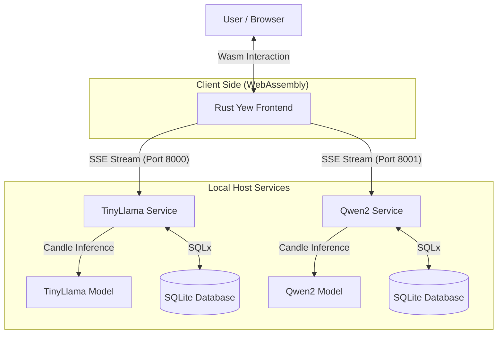
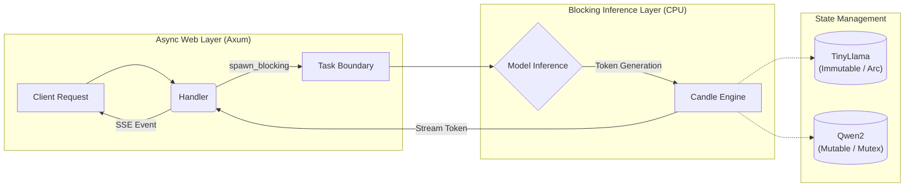

# RusChat - A Local, Privacy-First LLM Inference Service

## Team Members
*   **Ruoming Ren** (1005889013) - luke.ren@mail.utoronto.ca
*   **Kairui Zhang** (1007114640) - kairui.zhang@mail.utoronto.ca

---

## 1. Motivation
**Why Rust?**
In the current landscape of Large Language Models (LLMs), Python dominates due to its rich ecosystem. However, for a local, privacy-focused inference service, Python introduces significant overhead in terms of runtime latency and memory management (Garbage Collection pauses).

We chose **Rust** for this project to solve specific engineering challenges that Python cannot address effectively:
1.  **Latency & Memory Safety:** LLM inference is memory-intensive. Rust’s ownership model ensures memory safety without a Garbage Collector, preventing the "stop-the-world" pauses that disrupt the user experience during real-time token streaming.
2.  **Zero-Cost Abstractions:** By using the **Candle** framework, we leverage Rust’s ability to interact directly with low-level tensor operations (similar to C++) while maintaining high-level code safety. This allows us to run quantized models (like Qwen2 and TinyLlama) on consumer CPUs efficiently.
3.  **Unified Full-Stack WebAssembly:** Unlike a traditional stack (Python Backend + JS Frontend), Rust allows us to compile our frontend (Yew) to **WebAssembly (Wasm)**. This enables type sharing and ensures that the high-performance characteristics of Rust extend to the browser client.
4.  **Concurrency:** Rust’s `Tokio` async runtime is uniquely suited for handling multiple concurrent Server-Sent Events (SSE) streams, allowing the server to handle multiple chat sessions without blocking threads.

## 2. Objectives
The primary objective of RusChat is to build a fully self-contained, local chatbot system that operates **offline** without sending data to third-party APIs (like OpenAI).

Key technical objectives include:
*   **Microservices Architecture:** Deploying different models (TinyLlama vs. Qwen2) as independent services on different ports to isolate failures and manage resources.
*   **Native Inference:** Implementing LLM inference purely in Rust using `candle-core` and `candle-transformers`, removing the dependency on heavy Python runtimes like PyTorch in production.
*   **Persistent Context:** Implementing a storage layer using **SQLite** to persist chat history locally, allowing users to review past conversations.
*   **Real-Time Streaming:** Implementing a robust SSE (Server-Sent Events) pipeline to stream generated tokens to the frontend instantly.


## 3. System Architecture

### 3.1 High-Level Microservices Architecture
The system follows a microservices-inspired architecture to ensure modularity and fault tolerance. The Frontend acts as an orchestrator, communicating with two independent inference backends via HTTP and Server-Sent Events (SSE).



### 3.2 Backend Internal Design (Concurrency Model)
A critical challenge in local LLM inference is preventing the heavy computational load from blocking the web server's main thread. To solve this, we implemented a **Thread Isolation Strategy** within each backend service.

As illustrated in the diagram below, we separate the **Async Web Layer** (Axum) from the **Blocking Inference Layer** (Candle) using `tokio::task::spawn_blocking`. This ensures that the server remains responsive to heartbeats and cancellation requests even while generating tokens.



**Key Implementation Details:**
*   **Task Boundary:** The `spawn_blocking` function creates a bridge between the asynchronous event loop and the CPU-intensive model operations.
*   **State Management Strategy:**
    *   **TinyLlama:** Uses `Arc<Model>` (Atomic Reference Counting) for shared, read-only access, maximizing concurrent throughput.
    *   **Qwen2:** Uses `Mutex<Model>` to safely handle mutable internal states (KV-Cache updates) required for its specific architecture.

#### Technical Stack Highlights
To achieve a fully local and high-performance system, we integrated the following technologies:
*   **Axum Backend:** RESTful API endpoints for session management and chat streaming.
*   **Candle Framework:** Rust-native tensor operations enabling "CPU-First" inference.
*   **SQLx & SQLite:** Type-safe SQL queries for persistent storage.
*   **Yew & Wasm:** A high-performance, event-driven frontend compiled to WebAssembly.


## 4. Features
The final deliverable includes the following key features:

### A. Dual-Model Backend Architecture
We implemented two distinct backend services optimized for different tasks:
1.  **TinyLlama Service (Port 8000):** A **lightweight** inference server running `TinyLlama-1.1B`. It is optimized for speed and quick interactions.
2.  **Qwen2 Instruct Service (Port 8001):** A more capable reasoning server running `Qwen2.5-0.5B`. This service is integrated with a database to provide persistent chat history.

### B. Persistent Chat History (SQLite)
We implemented two distinct backend services optimized for different tasks, and both integrate with SQLite for persistent local chat history.

1. **TinyLlama Service (Port 8000):** A lightweight inference server running `TinyLlama-1.1B` for fast, low-latency interactions.
2. **Qwen2 Instruct Service (Port 8001):** A stronger reasoning server running `Qwen2.5-0.5B` for more complex prompts and higher response quality.


### C. Rust-Based Frontend (Yew + Wasm)
The user interface is built entirely in Rust using the **Yew** framework.
*   **Unified History Aggregation:** Since the system runs on two separate ports with independent databases, the frontend acts as an **Aggregator**. On startup, it asynchronously fetches chat history from both Port 8000 and Port 8001, merges the data, removes duplicates, and sorts them by timestamp. This provides the user with a seamless, unified view of their conversation history.
*   **In-Session Model Switching:** Users can dynamically toggle between "Llama 2" (Port 8000) and "Mistral/Qwen" (Port 8001) **within the same chat session**.
*   **Streaming UI:** The chat interface updates in real-time as tokens arrive via SSE, with support for stopping generation mid-stream.

## 5. User’s Guide
1.  **Launch the System:** Ensure both backends and the frontend are running (see Reproducibility Guide).
2.  **Access the UI:** Open your browser to `http://localhost:8080`.
3.  **Select a Model:** Use the dropdown in the top-left corner to choose a model backend (Port 8000 for fast chat, Port 8001 for history-enabled chat).
4.  **Chat:** Type a message in the input box and press Enter or click the Send button.
5.  **Stop Generation:** If the answer is too long, click the Red Stop button to interrupt the stream.
6.  **View History:** Click "New Chat" to start fresh, or select a previous session from the left sidebar to load old messages.
**Note:**  
To guarantee that all components can be built and executed on personal machines, this project avoids using large or resource-intensive models.  
The selected models prioritize deployability and low resource usage over advanced reasoning performance, as the focus of this course project is system architecture rather than model capability.


## 6. Reproducibility Guide
**Note to Instructor:** Please follow these steps sequentially. We assume a standard environment with Rust and Python (for model downloading) installed.

### Prerequisites
*   **Rust & Cargo:** `curl --proto '=https' --tlsv1.2 -sSf https://sh.rustup.rs | sh`
*   **Python 3:** Required only for downloading model weights from Hugging Face.
*   **Trunk:** Required to build the Yew frontend.
    ```bash
    cargo install trunk
    ```

### Step 1: Setup Backend 1 (TinyLlama)
1.  Navigate to the TinyLlama backend directory (folder named `server-llma2`).
2.  Install Python dependencies and download the model:
    ```bash
    pip install huggingface_hub
    python3 download_tinyllama.py
    ```
3.  Run the server:
    ```bash
    # This will listen on port 8000
    cargo run --release
    ```
    *Keep this terminal open.*

### Step 2: Setup Backend 2 (Qwen2 + Database)
1.  Open a **new terminal**.
2.  Navigate to the Qwen2 backend directory (folder named `server-qwen`).
3.  Download the model:
    ```bash
    python3 download_qwen_instruct.py
    ```
4.  Run the server:
    ```bash
    # This will listen on port 8001 and create chat.db
    cargo run --release
    ```
    *Keep this terminal open.*

### Step 3: Setup Frontend (Yew)
1.  Open a **third terminal**.
2.  Navigate to the Frontend directory.
3.  Start the development server:
    ```bash
    trunk serve --open
    ```
4.  This command will automatically open your default browser to `http://localhost:8080`.

### Step 4: Verification
*   **Test 1:** Select "Llama 2 (Port 8000)" in the UI dropdown. Type "Hello". You should see a streaming response.
*   **Test 2:** Select "Mistral (Port 8001)" (mapped to Qwen internally). Type "Tell me a story". You should see a response.
*   **Test 3:** Refresh the page. You should see the "Tell me a story" session appear in the History sidebar (loaded from SQLite).

## 7. Contributions

### Ruoming Ren
*   **Backend Infrastructure & Inference:** Designed the core Axum server architecture and implemented the candle-transformers integration to run both TinyLlama and Qwen2 models on the CPU.
*   **SSE Implementation:** Designed the run_streaming_generation loop, handling token encoding/decoding and the critical [DONE] signal for frontend termination.
*   **Database & Persistence** Engineered the SQLite storage layer using sqlx, handling schema migrations and implementing the logic to persist chat history efficiently.

### Kairui Zhang
*   **Frontend Development:** Built the complete Yew application (main.rs), implementing the UI and managing the  session state for model switching and history navigation.
*   **Integration & Debugging** Implemented the client-side EventSource logic for real-time streaming and frontend-backend connection to ensure smooth data flow.


**Note on Commit History:**
During the development process, we utilized separate repositories for the Frontend and Backend components to facilitate parallel development and avoid merge conflicts. The repository submitted here represents the consolidated, final version of our project.

## 8. Project Links

We have prepared a video presentation and a live demo to showcase the project's functionality.

*   **Video Slide Presentation:** [View Presentation demo](https://drive.google.com/file/d/1bw2-PqUl0m4oMj0oTX0fDZdaEAkE3ls9/view?usp=sharing)

*   **Video Demo:** [Insert Link Here]

## 9. Lessons Learned & Concluding Remarks
Throughout this project, we learned several valuable lessons about systems programming in Rust:

1.  **The Rigor of Rust Development:** Rust is an incredibly strict and rigorous language, which made the development process significantly harder and more time-consuming compared to dynamic languages like Python. The strict ownership model and type system forced us to handle every memory allocation and potential error case explicitly. While this phase was difficult and steep, it ensured that our final application was robust and free of common runtime errors.
2.  **Async Streams are Tricky:** bridging the gap between synchronous CPU-bound model inference and asynchronous I/O-bound web serving was challenging. We learned to effectively use `tokio::task::spawn_blocking` and `mpsc` channels to communicate between these two worlds without freezing the server.
3.  **Wasm Interop:** Debugging WebAssembly can be difficult. We learned to rely on `gloo-net` and browser console logging to trace errors in the frontend-backend communication.

**Conclusion:**
RusChat successfully demonstrates that Rust is a viable, high-performance alternative to Python for local AI applications. We achieved our goal of a private, offline-capable chat system with persistent history, proving that the Rust ecosystem (Axum, Candle, Yew, SQLx) is mature enough for complex full-stack AI development.
